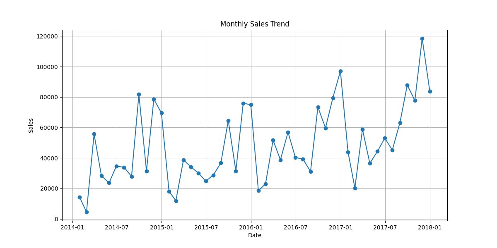
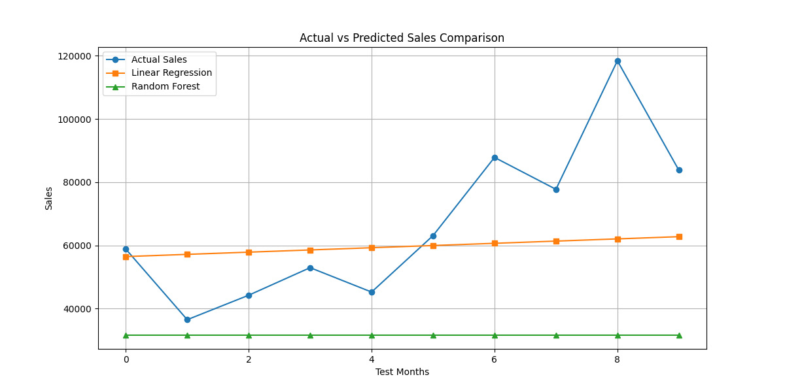
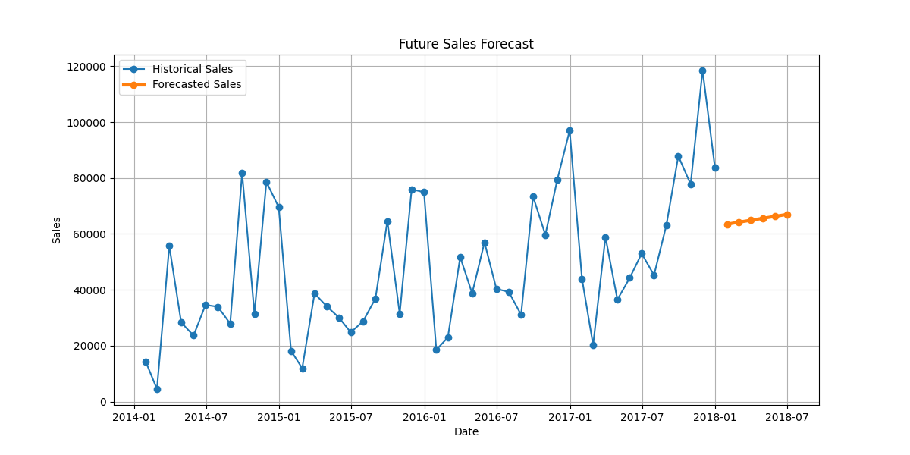

# Sales Demand Forecasting Using Machine Learning

## Project Overview
This project predicts future sales using historical Superstore sales data. The objective is to help businesses make informed decisions regarding inventory, staffing, and revenue planning.

## Dataset
Sample Superstore Dataset

## Technologies Used
- Python
- Pandas
- Matplotlib
- Scikit-learn

## Machine Learning Models
1. Linear Regression
2. Random Forest Regressor

## Evaluation Metric
Mean Absolute Error (MAE)

## Results

Linear Regression MAE: 18041.64

Random Forest MAE: 35268.56

Linear Regression performed better and was selected as the final forecasting model.

## Future Forecast
The model predicts sales for the next six months based on historical trends.

## Business Applications
- Inventory Management
- Demand Forecasting
- Revenue Planning
- Staffing Optimization

## Project Structure

Sales_Forecasting_Project/
├── data/
├── images/
├── sales_forecasting.py
├── forecast_results.csv
└── README.md

## Project Screenshots

### Monthly Sales Trend

### Model Comparison

### Future Sales Forecast

## Results

* Successfully analyzed 9,994 sales records.
* Built forecasting models using Linear Regression and Random Forest.
* Evaluated model performance using Mean Absolute Error (MAE).
* Generated future sales predictions for the next 6 months.
* Visualized sales trends and forecasting results.

## Future Enhancements

* Deploy using Streamlit.
* Add interactive dashboards.
* Use advanced forecasting models like ARIMA and Prophet.
* Connect to live business sales databases.

## Skills Demonstrated

* Python
* Pandas
* NumPy
* Matplotlib
* Scikit-Learn
* Data Analysis
* Machine Learning
* Forecasting
* Data Visualization
